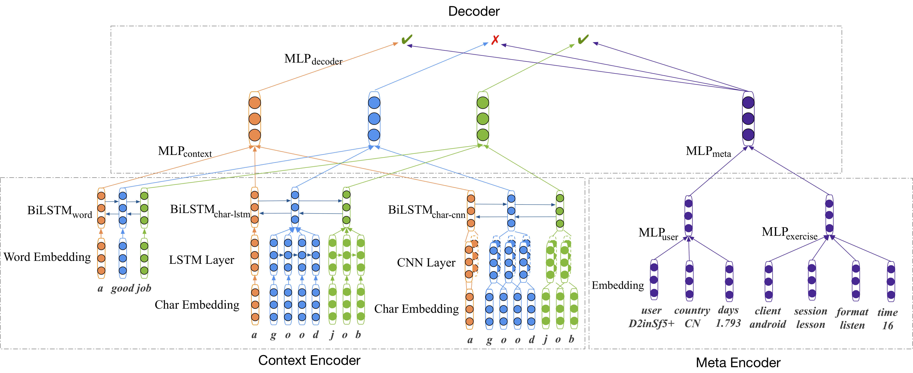

# MTL-SLAM
Code for paper: [Multi-task Learning for Low-resource Second Language Acquisition Modeling](https://arxiv.org/pdf/1908.09283.pdf)



More information about Second Language Acquisition Modeling(SLAM) can be found [here](https://sharedtask.duolingo.com/2018.html).

## Quick Reproduce
1. Download the processed dataset from [here](http://image.nghuyong.top/processed.zip) and move to `./data/processed`.

2. Install dependencies
```
pip install -r requirements.txt
```

3. Train model

```bash
# multi-task model
python -m models.multitask.run
# single-task model
python -m models.singletask.run
```

4. Test model
```bash
# multi-task model
python -m models.multitask.run --train_or_test=test
# single-task model
python -m models.singletask.run --train_or_test=test
```
